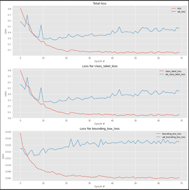
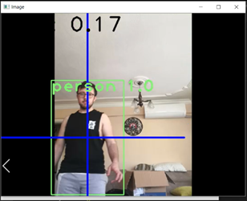

<b>This repository builded for my Thesis Project. This thesis project was made for general purposes computer vision missions and otonomous challenges.</b>
 
 

  
   

  <a href="#project">Thesis Project</a> •
  <a href="#how-to-use">Details</a> 

# Thesis Project

In this project, a rover vehicle that uses object detection algorithms under the deep learning sub-title of artificial intelligence and can navigate to the desired location autonomously has been designed to be used in military exercises, emergency situations, and search and rescue activities. The vehicle was built on a PPRC pipe body, considering the common needs of various areas. Thanks to the fact that the front of the vehicle is separate from the main body, the vehicle can pass the obstacles in front of it without compromising its integrity. Rover-type vehicles are widely used by countries and companies carrying out space studies today. This tool can perform object recognition operations from the image it takes from the camera it has. With the cameras connected to the servo motors on the vehicle, the desired objects can be followed and monitored. With the object recognition models and algorithms that can be developed in this way, it can be used in civilian activities such as search and rescue, and it will also be able to perform operations such as attack, defense, enemy detection, and casualty detection in military areas, thanks to its movable head. While performing these operations, the desired GPS location is reached autonomously and the actions that the vehicle has and can do are transmitted to the main user via the established network. Thus, while the vehicle is traveling to another desired location in a certain GPS location, it fulfills both its autonomous driving features and its image processing capabilities. In this way, services can be provided autonomously in various areas; It can be used in the fulfillment of tasks such as preventing the loss of soldiers in the military field, autonomously entering areas that people cannot enter in emergency situations and finding the desired person or objects. The fact that the vehicle can be developed in different areas prospectively and that its capabilities are designed to be stretched are features that are rarely seen in the literature and contribute. Today, there are various object detection algorithms in different fields and these methods can be easily used with the tool.
 
 
 
<h1>Photos from my thesis development process.</h1>

 

 

 

# Details

Details and other specification about rover design, electronics components and software can be found in Report.docx.

